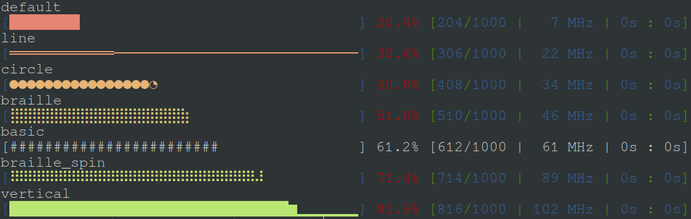

# tqdm-lua
 (unofficial) tqdm-like lua pretty progress bar

```lua
local tqdm = require "tqdm"

local N = 100000000
local bar = tqdm.new(N)
for i=1,N do
	bar:progress(i)
end
```

additionally you can select a different them for the bar
```lua
local themedBar = tqdm.new(1000):theme("circle")
```
####available theme

